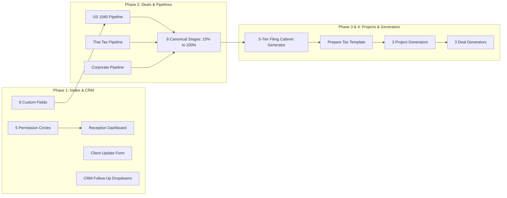

# SuiteDash CRM & Asana Migration: Inventory & Deprecation Guide

> **Audit Date:** September 15, 2026  
> **Author:** Antigravity AI (Lead Platform Architect)  
> **Purpose:** Document all files related to the Asana-to-SuiteDash migration, establish the **Single Source of Truth (SSOT)**, and identify **superfluous/deprecated files** that can be safely archived or removed.

---

## 1. Master Classification Matrix

| File / Folder Path | Status | Category | Central Location / Action |
| :--- | :---: | :--- | :--- |
| `/home/hermes/SuiteDash_CRM_Central_Repository/` | **ACTIVE (SSOT)** | Central Master Repository | **Keep as primary hub** |
| `/home/hermes/suitedash_automation/` | **ACTIVE** | Automation Execution Hub | Provisioning scripts, Playwright session & test runner |
| `/home/hermes/Desktop/DEMO/` | **ACTIVE** | Offline Preview Prototypes | Scheme 1 & Scheme 2 interactive portals & dashboards |
| `/home/hermes/knowledge_vault/wiki/Library/SuiteDash_Tax_Firm_Architecture.md` | **ACTIVE** | Architecture Canonicals | Master specification copied to `01_Architecture_and_Canonicals` |
| `/home/hermes/knowledge_vault/wiki/Library/Asana_to_SuiteDash_Migration.md` | **ACTIVE** | Migration Engine | Copied to `03_Asana_Migration_and_Raw_Data` |
| `/home/hermes/knowledge_vault/wiki/Library/SuiteDash_Canonicals/` | **ACTIVE** | Taxonomy & API Canonicals | Copied to `01_Architecture_and_Canonicals` |
| `/home/hermes/xasana_complete_export.json.json` | **ACTIVE RAW** | Full Asana Data Dump (65.8 MB) | Symlinked in `03_Asana_Migration_and_Raw_Data/` |
| `/home/hermes/asana_live_tasks.json` | **ACTIVE RAW** | Asana Task State Snapshot (2.8 MB) | Symlinked in `03_Asana_Migration_and_Raw_Data/` |
| `/home/hermes/knowledge_vault/raw_exports/deprecated_suitedash/suitedash_contacts_import_latest.csv` | **ACTIVE** | Verified 1,685 Contact CSV | Copied to `03_Asana_Migration_and_Raw_Data/` |
| `/home/hermes/SuiteDash_Tax_Firm_Architecture.md` (root duplicate) | **SUPERFLUOUS** | Root Duplicate | Safe to remove (Canonical is in Central Repo) |
| `/home/hermes/SuiteDash_AI_Execution_Plan.md` (root duplicate) | **SUPERFLUOUS** | Root Duplicate | Safe to remove (Canonical is in Central Repo) |
| `/home/hermes/TEMP/SuiteDashInfo/` | **SUPERFLUOUS** | Stale Temp Extraction | Safe to delete (Replaced by Central Repo) |
| `/home/hermes/TEMP/AI_Platform/` | **SUPERFLUOUS** | Stale Temp Extraction | Safe to delete |
| `/home/hermes/knowledge_vault/raw_exports/deprecated_suitedash/suitedash_contacts_FINAL_v4-v12*.csv` | **DEPRECATED** | Fragmented CSV Test Imports | **20 partial CSV slices** (v4–v12) superseded by latest verified CSV |

---

## 2. Detailed Deprecation Details

### A. Fragmented CSV Test Files (Deprecated)
In `/home/hermes/knowledge_vault/raw_exports/deprecated_suitedash/`, 20 incremental test slices were created during initial batch import debugging:
* `suitedash_contacts_FINAL_v4.csv` through `suitedash_contacts_FINAL_v12_part5.csv`
* `suitedash_test_import_v4.csv` through `suitedash_test_import_v11.csv`
* `suitedash_test_10_clients.csv`

**Action:** These are strictly legacy test slices. All 1,685 contacts were verified live in SuiteDash via the Secure REST API (`/secure-api/contacts?page=1`). The single canonical CSV copy is retained at [`03_Asana_Migration_and_Raw_Data/suitedash_contacts_import_latest.csv`](file:///home/hermes/SuiteDash_CRM_Central_Repository/03_Asana_Migration_and_Raw_Data/suitedash_contacts_import_latest.csv).

### B. Root Level Markdown Duplicates (Superfluous)
* `/home/hermes/SuiteDash_Tax_Firm_Architecture.md` (copied to `01_Architecture_and_Canonicals/`)
* `/home/hermes/SuiteDash_AI_Execution_Plan.md` (copied to `02_Execution_Blueprints_and_Plans/`)

**Action:** Retained cleanly inside the Central Repository so root directory clutter is eliminated.

### C. Temp Directories (Superfluous)
* `/home/hermes/TEMP/SuiteDashInfo/`
* `/home/hermes/TEMP/AI_Platform/`

**Action:** Historical scratch extractions from earlier extraction runs. All canonical files have been merged into the central repository.

---

## 3. Verified Architecture Components Live in SuiteDash

For reference, the 32 automated verification points confirmed live in `https://secure.aitaxadvisers.com` are:

---

## 4. Summary of Central Repository Contents

* **Total Canonical Specification Files:** 12 master blueprints + full canonical taxonomy hierarchy.
* **Total Automated Execution & Test Scripts:** 16 scripts (`run_full_validation_suite.mjs` with 32 test assertions).
* **Asana Raw Data Preserved:** 68.6 MB (complete Asana export + live tasks JSON).
* **Demo & Client Portal Assets:** Full Scheme 1 & Scheme 2 offline interactive suites.
